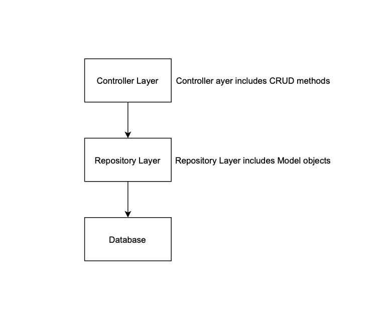
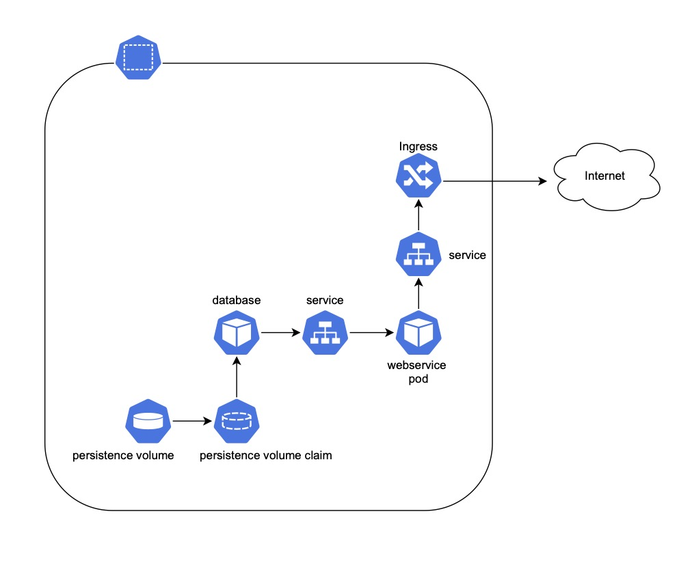

# Messages App
## Description
--
*Messages* app exposes CRUD operation for message resource of type string (min_length=1 and max_length=255) \
The following is the list of apis:

| API  | Desscription |
| ------------- | ------------- |
| [GET] /api/v1/messages  | Get a list of messages  |
| [GET] /api/v1/messages/{id} | Get a message by id  |
| [POST] /api/v1/messages | Create a message |
| [PUT] /api/v1/messages/{id} | Update a message  |
| [DELETE] /api/v1/messages/{id} | Delete a message  |

You can also access a more detailed list of available APIs by visiting `/api/v1/docs/` url after the application is deployed.
## Project Structure:

*messages* webservice app consists of two layers: controller layer and repository layer.
- controller layer contains the logic related to CRUD operations on message resource and error handling. This layer is represented as api folder.
- repository layer contains of message data model and its properties. This layer is represented as models.py file.

The following provides more details about the directory structure of the *messages* app: 
```
├── resources
│   └── images
├── Dockerfile
├── README.md
├── skaffold.yaml
├── wsgi.py
├── app
│   ├── config.py
│   ├── __init__.py
│   ├── models.py
│   ├── main
│   ├── api
│   └── exceptions.py
├── tests
│   ├── ...
├── entrypoint.sh
├── migrations
│   ├── ...
├── requirements.txt
└── helm
    ├── ...
```
Files:
 - *wsgi.py*: is the entry to run the application. We are using *unicorn* http server which is a wsgi compliant http server
 - *skaffold.yaml*: includes configuration for skafold to deploy the app in k8s local cluster
 - *requirements.txt*: includes projct dependencies

Directories:
- *resources*: includes images used in README.md file
- *app*: contains api related logic for message resource
- *tests*: contains unit tests
- *migrations*: contains migration scripts generated by flask_migration lib
- *helm*: contains helm delpyment templatess

<p>

</p>
<p>
<em>Architecture overview</em>
</p>

## Build and Deployment

The easiest way to build and deploy the *messages* app is to build and run it as a standalone docker container. In this mode, for simplicity, I am using an sqlite database for persistence. 

To use Mysql database for persistence, you can deploy the *messages* app using helm. For the purpose of this demo, I am using minikube as local kubernetes.

Please refer to **Perequisites** section to prepare your local enviroment before deployment of the app.

There are three options to build and deploy *messages* app locally
1. **Standalone** \
To build and deploy the app as a standalone docker container:
    - `docker build -t messages-webservice:latest .` \
        Note:  `.` means you are ruuning this command at the root directory of the project
    - `docker run --rm --env ENV_NAME=DEV -p 80:80  -it messages-webservice:latest`

2. **k8s with helm and skaffold** \
To build and deploy the app in minikub cluster using skaffold to run helm charts: 
    - `skaffold run`

3. **k8s with helm** \
To build and deploy the app in minikub cluster using helm:
    - `docker build -t messages-webservice:latest .`
    - `helm repo add bitnami https://charts.bitnami.com/bitnami`
    - `helm install db bitnami/mysql --set auth.rootPassword=passwordroot --version 8.5.0 -f <path_to_project_root>/messages/helm/db/values.yaml --kube-context minikube`
    - `helm install mw <path_to_project_root>/messages/helm/messages -f <path_to_project_root>/messages/helm/messages/values.yaml --kube-context minikube`

### Perequisites

The first perequisite, no matter which of above-mentioned options you chose for your depmloyment is that you run Docker on your local enviroment. Please follow this link to setup Docker if you don't have it already https://www.docker.com/get-started

If you are building and deploying the messages app as a standalone docker container, no further setup is required. In this mode, for simplicity, sqlite databse is used to store the message. 

If you are building and deploying the messages app in local k8s with Mysql database, follow the following steps:
1. Install minikube https://minikube.sigs.k8s.io/docs/start/ \
If you are osx user, run `brew install minikube` Follow these steps after minikube is installed :
    - Run `minikube start`
    - Run `minikube addons enable ingress`
    - Append the following line (messages app hostname) to your hosts file `/etc/hosts` \
     `<minikube_ip> messages-webservice` \
      replace `<minikube_ip>` with minikube VM IP and to get minikube IP run: `minikube ip`
2. Install helm https://helm.sh/docs/intro/quickstart/ \
If you are osx user, run `brew install helm`

3. If you want to use skaffold to run helm charts, install skaffold https://skaffold.dev/docs/install/ \
If you are osx user, run `brew install skaffold`

<p >

</p>
<p>
<em>k8s deployment overview</em>
</p>

## Unit Test
To run unit tests, follow the these steps:
1. Build docker images by running the following command at the root path of the *messages* app:
    - `docker build -t messages-webservice:latest .`
2. Run the tests:
    - `docker run messages-webservice:latest python -m pytest -v tests -x`

## Note
These assumtions are made to determine if a message is palindrome:
- message is a string
- message should contain only alphanumeric character
- leading and trailing whitespaces are consided as part of message 
- the operation is not case sensitive 
